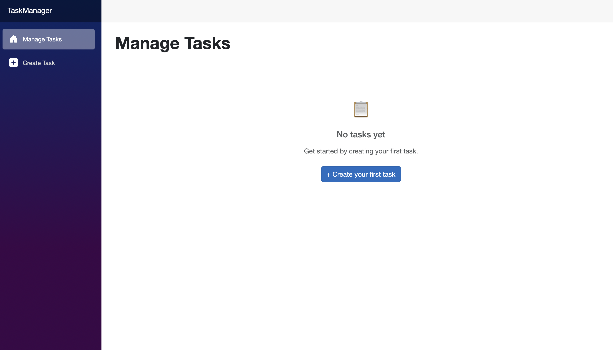
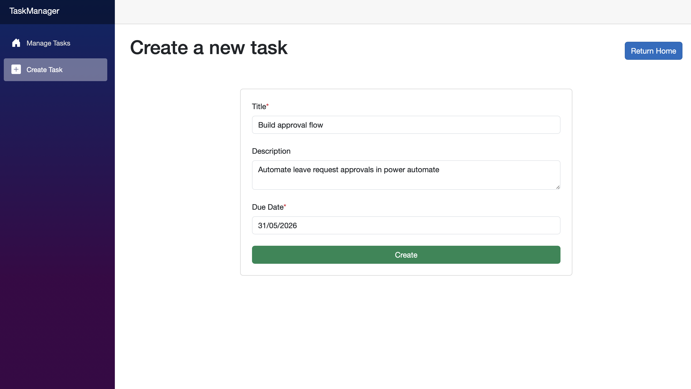
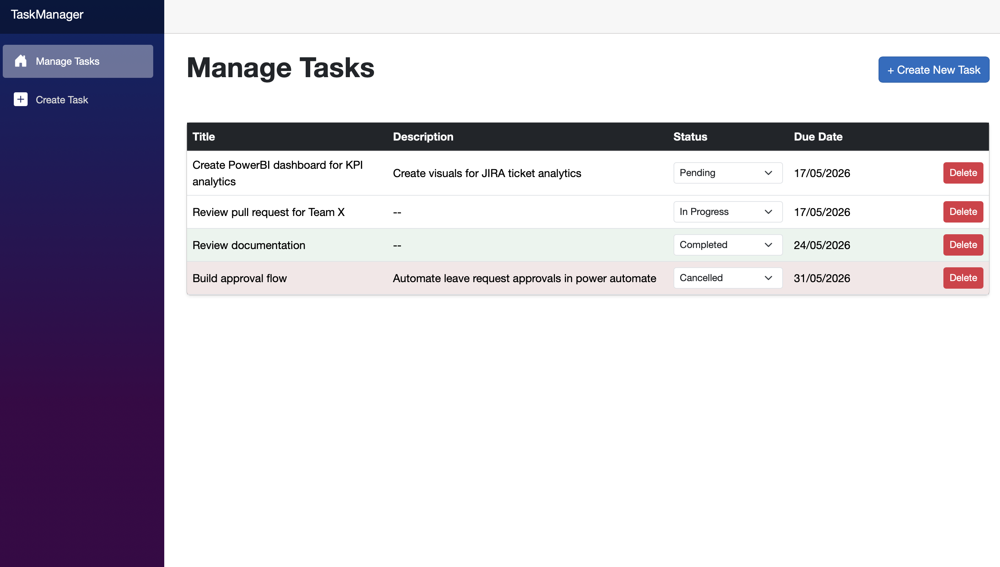
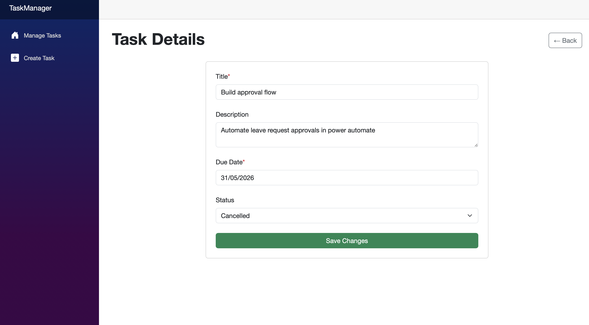

# HMCTS Task Manager

A simple task management system designed for caseworkers to create, track, and manage tasks efficiently.

## Tech Stack
- **Backend:** ASP.NET Core Web API, Entity Framework Core, SQLite
- **Frontend:** Blazor Server (.NET 10)
- **Tests:** xUnit

### Why Blazor?

Although HMCTS provided starter templates for a Java backend and a Node.js frontend, the brief allowed flexibility in choosing other technologies. I decided to take a different approach, using ASP.NET Core for the API and Blazor Server for the frontend, keeping the entire stack in C#.

While I have some experience with JavaScript, I had recently completed a course where I built a REST API integrated with a Blazor frontend, and I wanted to apply that knowledge in a real project. Working within the .NET ecosystem also allowed me to move quickly and maintain consistent patterns across the API, frontend, and tests without needing to switch between languages or toolchains.


## Prerequisites

- [.NET 10 SDK](https://dotnet.microsoft.com/download)

Verify installation:
```
dotnet --version
```

## Running the Application

The solution consists of two projects: the API and the frontend. Both need to be running simultaneously.

1. Clone the repository and navigate into the project folder

2. **Terminal 1 — API**
```
cd TaskManager.Api
dotnet run
```
Runs at `http://localhost:5282`

3. **Terminal 2 — Frontend**
```
cd TaskManager
dotnet run
```
Runs at `http://localhost:5026` 

If the browser does not open automatically, navigate to `http://localhost:5026`.

## Troubleshooting

**NuGet packages fail to restore on Windows (common if project is in OneDrive):** OneDrive can interfere with NuGet's package cache. First, check that nuget.org is configured as a source:
```
dotnet nuget list source
```
If `https://api.nuget.org/v3/index.json` is missing or disabled, add it:
```
dotnet nuget add source https://api.nuget.org/v3/index.json -n nuget.org
```
Then run `dotnet restore`. If the issue persists, move the project to a local folder outside OneDrive and try again.

## API Endpoints

| Method | Endpoint | Description |
|--------|----------|-------------|
| GET | `/api/tasks` | Get all tasks |
| GET | `/api/tasks/{id}` | Get task by ID |
| POST | `/api/tasks` | Create a task |
| PATCH | `/api/tasks/{id}/status` | Update task status |
| PUT | `/api/tasks/{id}` | Update a task (title, description, due date, status) |
| DELETE | `/api/tasks/{id}` | Delete a task |

**Allowed statuses:** `Pending`, `InProgress`, `Completed`, `Cancelled`

## Validation & Error Handling

**Error Handling in API**
- **Title is required** - returns `400 Bad Request` if title is missing
- **Not found** - returns `404 Not Found` for requests on non-existent tasks
- **Delete** - a successful delete operation returns `204 No Content`

**Front End Validation**
- **Title and due date required** - the create button remains disabled until both a title and due date are provided
- **Error message** - if the create task API call fails, an error message is displayed briefly

> **Note:** CORS is configured to allow any origin for local development. In a production environment this should be restricted to the known frontend origin.

## Running Unit Tests

The test suite covers all core service methods including creating, retrieving, updating, and deleting tasks. Tests use an in-memory database so no setup is required.

From the root of the project, run:
```
dotnet test TaskManager.Tests
```

## App Demo

### Empty State
When no tasks exist, the application displays an empty state prompt encouraging the user to create their first task.



### Creating a Task
Users can create a task by providing:
- A title (required)
- An optional description
- An optional due date

The **Create** button remains disabled until a title and due date have been entered, preventing empty submissions. A success message confirms the task was created, and the user is automatically returned to the manage tasks screen. 

If the task fails to create, an error message is displayed briefly before clearing automatically.




### Managing Tasks
All tasks are displayed in a table ordered by due date. From here, users can:

- **Update status** — use the dropdown to change a task between Pending, InProgress, Completed, and Cancelled
- **Delete a task** — permanently removes the task from the system
- **Open a task** - select a task in the table to open its details page, where you can make edits

To enhance usability, conditional formatting is applied to the list: cancelled tasks are highlighted in red, while completed tasks are shown in green, making them easy to distinguish at a glance.



### Updating an existing task
Users can update an existing task by selecting it from the table on the home screen, which opens the task details page. From here, users can view all task information and modify the title, status, and description. The **Save Changes** button is disabled if title or due date are empty.



## Future Improvements

- **Authentication & authorisation** — restrict access to authenticated caseworkers only
- **CORS restriction** — limit allowed origins to the known frontend URL in production
- **Task filtering & search** — filter by status, search by title